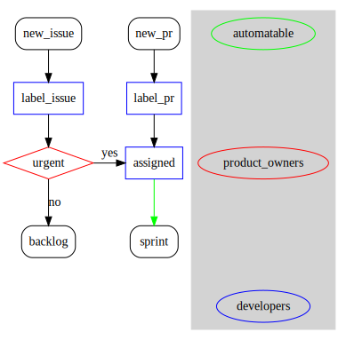
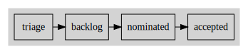
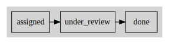
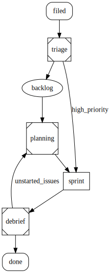
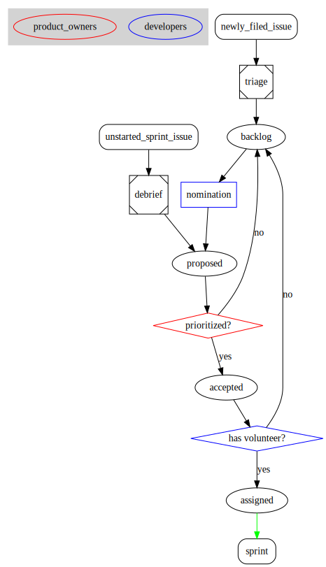
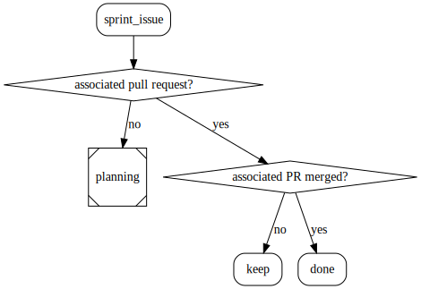
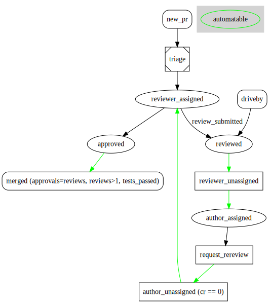
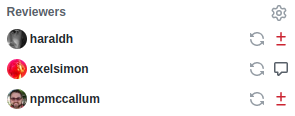

# Agile Sprint Process for Enarx
- Authors: [Mark Bestavros](mbestavr@redhat.com)
- Status: [PROPOSED](/README.md#proposed)
- Since: 2020-05-06
- Status Note: Concept brainstormed, awaiting implementation
- Supersedes: N/A
- Start Date: 2020-05-01
- Tags: process, sprint, concept

## Summary

Enarx has been using its daily standup and board organization for a while. It's
worked for us as a small team, but as we grow, we anticipate it becoming
unsustainable. It also doesn't do a good job capturing the current thrust of our
work. This RFC proposes a replacement process, designed around the agile sprint
methodology.

## Motivation

The Enarx project needs to organize its work better, and in a more sustainable
way than before. We need to do a better job planning for medium-term work and
goals, and in a way that scales more effectively than our prior process.

### Tracking Work

As a GitHub-native project, Enarx categorizes its work with the two major
primitives available: **issues** and **pull requests** (sometimes abbreviated
PRs).

- **Issues** on GitHub take the form of a simple text note in Markdown. Each one
  has a title and can be assigned metadata such as labels and assignees.
  
  They represent work that needs to be planned, implemented, or otherwise
  completed. An issue may encapsulate any task related to the project, and
  scope can vary wildly from one issue to the next; where one may be a simple
  formatting fix, others might be a radical design change. Presently (and for
  the foreseeable future), the Enarx project uses them exclusively to organize
  tasks yet to be done, discussion topics, and more (even when not strictly
  needed).

- **Pull Requests** (or PRs) are a proposal of code changes sent from an updated
  or otherwise altered version of a repository back to the original, upstream
  one. GitHub presents them as a series of diffs and allows discussion and
  review on them.

  PRs are fundamentally different from issues in that they represent completed
  (or close to it) work that needs to be reviewed for acceptance into the Enarx
  project. Where issues represent the beginning of a task, a PR represents the
  end of one. As such, providing thorough review and pushing them across the
  finish line should always be considered a priority.

The Enarx project's current process uses these two distinct units of work
already. The goal of this proposal will be to provide a more coherent and better
organized use of these primitives, augmented by processes designed around them.

## Team Roles

Traditional agile methodologies converge broadly around a set of roles for team
members to fall into. As a starting point, it may be worth considering the
three roles in [Atlassian's](https://www.atlassian.com/agile/scrum/roles) scrum
guidelines:

- Product owner: project leadership in touch with the larger organization. They
  are most responsible for understanding project needs and pushing the project
  where it needs to go.
- Scrum master: responsible for running sprint meetings and ensuring the entire
  process runs smoothly
- Development team: people working on individual components of the project. Not
  necessarily developers; may also encapsulate docs writers, outreach, or other
  roles.

This proposal will focus most broadly on the responsibilities of individual
development team members as well as project leadership from the above
definitions.

## Common Concepts

A few things will be referenced throughout the proposal; they will be defined
here.

### Triage

Triage is where the team will categorize newly-filed issues and pull requests,
and where product owners will be able to express needed urgency over those
items. It's an important process that is used in several places throughout this
document, so it's being introduced as its own concept.

The process is illustrated in the following flowchart:

Issues and PRs are deliberately separated, since they represent different units
of work and should be handled as such.

Firstly, incoming issues and PRs (contained within the "Triage" column of the
Planning board, detailed below) are labeled according to the category or
subdomain of the project. For example, they may be labeled as `sgx`, `sev` or
`infrastructure`. This categorization is undertaken by the team as a whole.

From here, the process differs:

- Issues represent descriptions of work that may need to be done. These can
  range from a low-priority polish task to an urgent security flaw. Recognizing
  this, the next step in the process is a decision by the stakeholders:
  **is this urgent?** If so, it should be assigned to a team member and
  promoted to the current sprint. Doing so recognizes its importance and
  makes it an immediate priority. If it's not considered urgent, it will be
  dropped in the project's backlog for later consideration.

- PRs represent work that has already been done and needs to be reviewed before
  being merged into the main codebase. As such, they will almost always be
  attached to an issue in the current sprint, and should be treated as an
  extension of that issue. The sole purpose of triaging a new PR is to ensure it
  has reviewers requested and assigned. Once that's done, it gets put in the
  current sprint.

### Project Boards

A common concept in many project workflows, the **project board** is also how the
Enarx project organizes its work.

Currently, the project uses multiple area-specific boards. This proposal
abandons that idea and instead consolidates to two boards:

- the **Planning board**, where the project's backlog and planning columns sit;
- the **Active Sprint board**, which contains issues and associated pull
  requests actively being worked on as part of the current sprint.

#### Planning Board

The planning board will contain the following columns:

- triage: Landing place for all new issues not yet part of the project board
- backlog: collection of issues not currently being worked on
- nominated: issues nominated by team members for the next sprint (planning)
- accepted: issues the team should work on next sprint (planning)

Here's a diagram:

#### Active Sprint Board

The Active Sprint board will contain the following columns:

- assigned: issues actively being worked on by an assigned team member
- under review: all submitted PRs go here while awaiting review
- done: all issues and PRs go here when done or merged, respectively

Here's a diagram:

In more technical terms, both boards would be an organization-level GitHub
projects. This will allow for issues and PRs across _any_ Enarx repository (not
just the main one) to be included, which supports modularization of the project
as it grows.

## Meetings

The concepts and processes introduced above are put into action in the form of
several team meetings that happen throughout the process of a single sprint.

To start, consider this high-level overview of how an issue progresses through
the process, beginning with its opening and continuing all the way until it's
considered done:

This flowchart introduces the three crucial events of the process, each of
which is encapsulated by its own team meeting:
 
 - **Planning**, a meeting representing the start of a new sprint
 - **Daily Standup**, the team's daily meeting where, among other things,
   **Triage** is performed.
 - **Review**, a meeting representing the end of a sprint where, among other
   things, **Debrief** is performed.

Once an issue is filed, it will be categorized and discussed in Triage. If
urgent, it's injected straight into the current sprint; if not, it gets pushed
to the backlog. From there, the rest of the cycle will carry it through to
completion: Planning will sooner or later land it as part of a sprint, where it
will become a team member's action item to complete. At the end of the sprint,
Review will allow the team to acknowledge its completion or need for extra time
as appropriate. When finished, the issue is considered complete.

The following sections will dive deep into the process of each meeting,
carefully considering actions that need to be taken, who should be responsible
for those actions, and how automation might be able to aid those actions.

### Planning

Sprint planning constitutes the beginning of a new sprint. It's where the team
and project leadership collectively decide what the project's focus should be.

The sprint planning process is illustrated in the following flowchart:

(For an explanation of shapes and colors, see [the appendix](#flowchart-shapes-and-colors))

Note that sprint planning only considers issues, not pull requests.

The meeting will start with a triage, as described above. This exists to ensure
no issues are uncategorized before the planning step. (This is necessary since
sprint planning will supersede the day's standup and, consequently, its triage,
as described later.)

#### Nomination

With the backlog fully up to date after the triage, the entire team will take
a small amount of time to **nominate** issues from the area they work on that
they think are most compelling. It should be each individual team member's
responsibility to nominate issues of interest _before_ planning begins;
however, some time may be allowed for last-minute nominations. A general rule
of thumb to follow should be that every team member nominates twice the work
they think they are able to do in a given sprint.

#### Issue acceptance

Once nomination is complete, the **Proposed** column of the Planning board will
be populated with a full set of proposed issues to work on for the next sprint.
Issues may also arrive in this column if they were not started in the previous
sprint. The process for determining such issues is further detailed in the
[Review](#review) meeting (detailed more below).

With that done, the product owners now have the responsibility to prioritize
the proposed work. If it's something that should get done in the next sprint,
the stakeholders can move it to **Accepted**; if it can wait, it should be
moved back to the backlog.

#### Acceptance criteria

It is the product owner's responsibility to only accept issues that meet
acceptance criteria:

- it must be well-scoped, and have a clear definition of completion, including
  documentation if needed
- it must be doable in a single sprint

If an issue cannot be accomplished in a single sprint, it should be decomposed.
In the rare scenario that an issue cannot be decomposed, it needs to be signed
off by the product owners to be included in a sprint.

Additionally, the product owners must be careful to accept a reasonable amount
of work from Proposed and not overload the team members. The purpose of this
step is not to express that all work is important; that's counterproductive and
doesn't accomplish anything.

A good rule of thumb is to accept half of the tasks in Proposed -- since team
members should be promoting twice the work they can do, that should balance out
to a roughly reasonable amount of work. Additionally, stakeholders should keep
in mind the possibility of "drive-by" contributions and the developer time
required to ensure they receive needed attention when thinking about task load.

#### Volunteering

At this point, the Accepted column should contain a prioritized, well-sized list
of tasks for the next sprint. The final step is to look for volunteers for each
task. This _should_ be straightforward, given team member specialties and focus
areas. If, for whatever reason, a team member doesn't think they can handle the
workload of an individual task, this allows them one final opportunity to opt
out (in good faith). The expectation should be that the vast majority of tasks
get volunteers.

Once a task has a volunteer, they should get assigned to it. From there,
automation will handle moving it into the Assigned column of the Active Sprint
board.

Once this has been repeated for all tasks in Accepted, the workload for the
coming sprint has been defined, and sprint planning is complete.

This meeting should be scheduled for the hour immediately following the
review. The two combined meetings should collectively replace the daily standup
on the first day of a new sprint. Here's a possible time breakdown:

- 10 min: triage
- 5 min: last-minute issue nomination
- 30 min: discussion of all nominated issues and whether they are project
  priorities 
- 15 min: volunteering and assignment

### Daily Standup

Daily standup is the team's daily check-in meeting, and when the **Triage**
process is performed. It should provide an opportunity for individual
contributors (and guests) to ask questions, elaborate on blockers, and ask for
help if needed.

As noted before, triage is the single most important component of this meeting,
and should therefore be done first. The exact process of triage is detailed
separately in the [Triage](#triage) section. Triage should not be strictly
time-bound; if productive discussions are happening around a new issue or PR,
those should be allowed to happen naturally.

The decision to make triage a part of daily standup is deliberate: it allows
issues and PRs filed by "drive-by" contributors (that is, people not part of
the project that still wish to contribute) to receive human consideration after
a maximum of 24 working hours -- a desirable property for open source.

Following triage, the scrum master will pull up the Active Sprint board for an
informal board review. This does not need to go over every single issue;
rather, it should be an opportunity for team members to point out highlights or
interesting updates to their tasks, and request help on blockers or otherwise.
To facilitate this, the scrum master should ask the meeting's attendees for a
quick show of hands on if they have something they wish to talk about; this
will allow the scrum master to keep time constraints in mind and move
conversations along if they're taking up too much time.

Finally, the rest of the meeting should be dedicated to open-ended project
discussion. If there are guests to the call, the team should welcome them and
allow them to ask questions. If there are any other topics to cover, they should
be brought up here.

Standup should take no longer than a half-hour, and should be scheduled as
follows:

- 10-15 min: triage
- 15-20 min: Board review/blockers/project discussion (however long is left
  after triage)

### Review

The final meeting is **Review**, which represents the end of a
sprint. It is a time for the whole team to reflect on work accomplished, demo
new things, and discuss how to approach tasks that didn't get completed.

Most of these topics will take the form of discussion. The only significant
process to detail here is **Debrief**, the workflow for reviewing issues
and PRs from the last sprint.

Any issues that both:

- don't have an associated deliverable (either a pull request or some other
non-code-related item, such as documentation or other assets);
- are not closed

are assumed to be "not started".

However, any issue that made it into the sprint in the first place is probably
still important, so it should be considered as such for the next sprint as well.
Thus, it will be sent to the next Planning meeting as a Proposed issue (see
[Planning](#planning) for more details).

If it _does_ have an associated PR, the next question to ask is whether that
associated PR was merged or not. If it was, then the issue is completed. If not,
that means the PR is still in review and likely just needs a bit more review
time. Thus, it should stay as-is in the Under Review column.

Debrief should happen immediately following demos (if there are any). Putting
demos first allows those interested to see them without having to sit through
the minutiae of project discussion; all stakeholders (including those beyond
the project; for example, the product owners' superiors) should be invited to
these demos so they can get a sense of the progress made in the last sprint, or
since they were last able to attend a demo.

Beyond that, the rest of the meeting should be dedicated to **Retrospective:**
high-level discussion about the project's accomplishments and the sprint process
itself. What worked? What didn't? What about the process could be changed for
the better?

Sprint reviews should take a full hour. As detailed in [Planning](#planning),
the two meetings should be combined, with Debrief happening first, replacing
the standup of the first day of a new sprint.

Here's a proposed schedule:

- 20 min: Demos (if applicable)
- 20 min: Debrief (review issues/PRs from last sprint)
- 20 min: Retrospective (process discussion/project retrospective)

## Pull Requests

The meetings above detail how we organize and plan our work with issues. This
section will elaborate how the team should execute that work with pull requests.

As described [above](#tracking-work), pull requests encapsulate the end of a
task. Pushing them across the finish line, whether that means providing review
or addressing those reviews, should always be a priority. As such, it's
important to communicate who needs to take action on a PR at any given time. The
Enarx project's current workflow does not do this well, and it's an obvious area
for improvement.

### Workflow

Here's a flowchart of the new and improved proposed workflow for a pull request,
starting with a PR's submission and going all the way to its merge:

As with every issue, every PR will be reviewed through a Triage, during which
reviewers will be requested and assigned. At least two reviewers must be
assigned for review, though the PR author may optionally request other people
review it without explicitly assigning them. These "optional reviewers" may
choose not to review it; however, if they _do_ submit a review, they are
expected to follow through the entire process until the PR is merged.

Note that the flowchart follows the flow for an individual reviewer and the
author; this process is replicated for every individual reviewer involved with
the PR.

The cycle starts with the `reviewer_assigned` state, which indicates that it's
the reviewer's responsibility to submit a PR review.

Once the reviewer submits a review, two things can happen based on the content:

- If the review approves of the PR, it moves into the `approved` state for that
  individual author. From here, the PR waits on other reviewers until it meets
  the criteria for merge (detailed [below](#merge-criteria)).
- If the review requests changes, it moves into the `reviewed` state. A PR can
  arrive here either through an assigned reviewer submitting a review, or
  through a "drive-by" reviewer that requests changes.

Once a PR is in the `reviewed` state, automation will take care of updating
assignees to reflect whose responsibility the PR is at the present time:

- The reviewer that submitted the review is unassigned.
- The PR author is assigned to the PR to address the reviewer's feedback.

Once these two are done, the PR moves into the `author_assigned` state. At this
point, it's the author's responsibility to address the review they've received.

When the author believes they have addressed the reviewer's feedback, they must
request a re-review using the button present in the Assignees tab next to the
Changes Requested indicator:

This is represented by the `request_rereview` state
in the flowchart. From here, automation again helps the process along:

- If the author does not have any other outstanding reviews, they are unassigned
  from the PR.
- The reviewer that submitted the now-addressed review is re-assigned, and the
  PR is moved back to the `reviewer_assigned` state.
  
At this point, the cycle is complete, and it repeats from the beginning until
the reviewer is satisfied with the PR and submits their approval.

### Merge criteria

With a clear framework in place for reviewing and approving pull requests, it's
now more feasible for the Enarx project to begin enforcing stricter merge
requirements.

A pull request should only be merged when:

- all required code tests pass
- it has two or more reviews in the `APPROVED` state
- it has no reviews in the `CHANGES_REQUESTED` state

The latter exists to ensure that all feedback from all reviewers is addressed
before merge.

While not a hard (testable) requirement, reviewers should also keep
documentation needs in mind: if a change requires documentation to be
understandable and/or maintainable, PRs should include such documentation in
order to be considered "complete".

With concrete criteria in place, automated merging, a longer-term automation
goal, may become feasible. This is represented by the final green arrow from
`approved` to `merged` in the flowchart.

## Drawbacks

- The team will need to attend a few more meetings. The daily standups, as
  currently designed, lose their focus on individual areas of the project per
  day; this was useful in case an external contributor was interested in one
  specific area of the project. However, we hope the added free-form discussion
  time will allow for relevant questions to be asked and talked about anyway.

- Implementing some of the automation exactly as specified may end up being a
  challenge. There's further discussion of this below.

## Rationale and alternatives

There are many ways to approach sprints, and we can't claim this is the best
possible sprint methodology out there; only time will tell if this works for us
once we start using it. Additionally, this process is not set in stone; anything
can change from one sprint to the next. However, there are a few nice
characteristics worth highlighting:

- Enarx is still a fairly small team, and we like some flexibility in our
  process. The modular design of our boards support that -- for example, if we
  consider a new issue or pull request particularly important, we can manually
  assign it and have it skip the backlog entirely.
- Moving to two organization-level boards allows visitors to see a snapshot
  of our backlog and what's currently being prioritized and worked on.
- With automation, this process has potential to minimize the busywork that
  project developers have to deal with, and only require human judgment when it
  is truly needed.
- Running through a triage every day ensures issues are promptly reviewed by the
  team after they are submitted.

## Prior art

The Enarx project's current process of topic-specific boards largely informs
this proposal's approach to the backlog. In fact, this proposal could be
considered an extension or adaptation of the current process in some ways.

And, of course, the agile sprint methodology is widely employed just about
everywhere in software; see
[Atlassian](https://www.atlassian.com/agile/scrum/sprints) and
[Trello](https://blog.trello.com/beginners-guide-scrum-and-agile-project-management)
for good examples. And, of course, Red Hat
[itself](https://developers.redhat.com/blog/2017/06/29/agile-software-development-the-red-hat-way/)
uses it.

## Unresolved questions

The most significant unresolved question does not involve process, but rather
how the automation we hope to pair with it will look.

While we have experience developing automation against a repository project, the
latter is certainly preferable in theory: it would allow us to not only track
issues across the mainline Enarx repo, but also any other organization
repositories (for example, enarx.github.io). This is ideal as the project grows
and subcomponents are potentially spun off into their own repos.

However, it's currently unclear how we'd implement the proposed automation
features we want to have with organization-level projects.

The project automation we've been developing up to this point takes place in the
context of a single repository, and interacting with projects that live in that
single repository. Our Python bot uses the
[`GITHUB_TOKEN`](https://help.github.com/en/actions/configuring-and-managing-workflows/authenticating-with-the-github_token)
provided as part of the Actions event we act on, which allows us to authenticate
write actions against the GitHub API such as adding labels, moving issues and
PRs into projects, etc. Unfortunately, **the `GITHUB_TOKEN` is only scoped to
the current repository,** making write actions against non-repository projects
(including parent organization projects) impossible with this method.

So, how else can we achieve write access to organization projects? There are two
alternatives, both with tradeoffs:

- Using a [personal access
  token](https://help.github.com/en/github/authenticating-to-github/creating-a-personal-access-token-for-the-command-line)
  as our secret instead of the `GITHUB_TOKEN`
- Developing a [GitHub App](https://developer.github.com/apps/about-apps/) that
  does the project actions we need

Personal access tokens are not ideal in terms of security: it's effectively a
persistent key that allows scripts to take actions on a user's behalf. Unlike
the `GITHUB_TOKEN`, which is only valid for an hour, it's active until it's
disabled, making it a potentially dangerous secret to persist. Additionally, the
permission toggles available are _very_ coarse -- you have to effectively give
write access on a per-repository basis.

A GitHub app is much better in terms of security: just as with Actions, they're
provided with temporary tokens that expire after an hour. Additionally, their
permissions are very granular and -- crucially -- **include the ability to write
to organization projects**.

The major downside is that we'd need to host and maintain this app somewhere --
so we lose the nice, low-maintenance, stateless automation we get with GitHub
Actions. Plus, we might potentially need to learn a whole new way of interacting
with the GitHub API.

All that said, we don't necessarily have to switch our entire automation suite
over to this theoretical bot. We could likely supplement our existing Actions
suite. But that doesn't change the high initial investment needed to make one
work.

We do have more potential leads to investigate;
[Bors](https://github.com/graydon/bors), the Rust project's GitHub bot, might be
a model we can follow.

The likely best solution at this point does invove a personal access token,
though set up in such a way that security risks are minimized to the extent they
are able.

## Future Possibilities

### Sprint Constructs

This proposal does not currently flesh out a number of "traditional" sprint
constructs such as:

- user stories
- epics
- teams
- milestones
- releases
- backlog grooming

In some cases, it remains to be seen how these constructs are compatible with
open-source development, since traditional agile methodologies are designed with
a fixed team in mind -- which may not be the case for Enarx, or indeed many
open-source projects.

### Automation

There will likely be many more ideas for project automation as this framework
matures and we develop a better understanding of the automation options
available to us. Here's an idea around the Active Sprint board that might be
viable once we have a better understanding of how the process works.

- Automation opportunity: If pull requests have an associated issue, don’t put
  the PR on the board -- instead, move the associated issue to the board (if not
  on it already) and treat the issue like the pull request, subject to the same
  movement rules as specified above. This would prevent us from having to look
  at the same thing twice, while still preserving a direct link to the PR in the
  context of its issue (since GitHub now displays linked PRs as a dropdown on an
  issue).

## Appendix

### Flowchart Shapes and Colors

The flowcharts included with this proposal roughly follow [the standard ISO
format](https://en.wikipedia.org/wiki/Flowchart) for shapes. Key shapes to note:

- Rectangles with rounded corners indicate the beginning or end of a process, or
  an input.
- Rectangles with sharp corners indicate an action taken.
- Diamonds indicate a yes-no decision.
- Ovals indicate a state.
- Squares with diagonal edges inside indicate a sub-process, defined in another
  flowchart.

Flowcharts are also color-coded to indicate responsibility and automatability:

- Red indicates product owner responsibility.
- Blue indicates team member responsibility.
- Green indicates an automatable state change (for example, automatically
  assigning someone to a PR).
